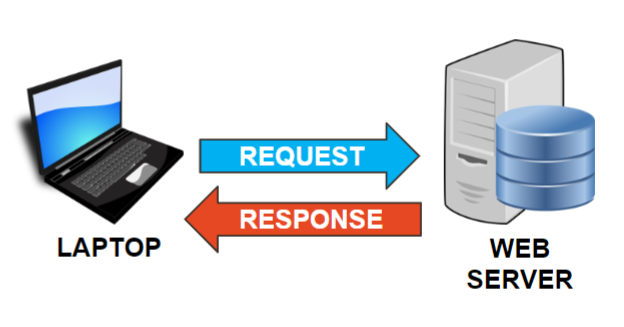
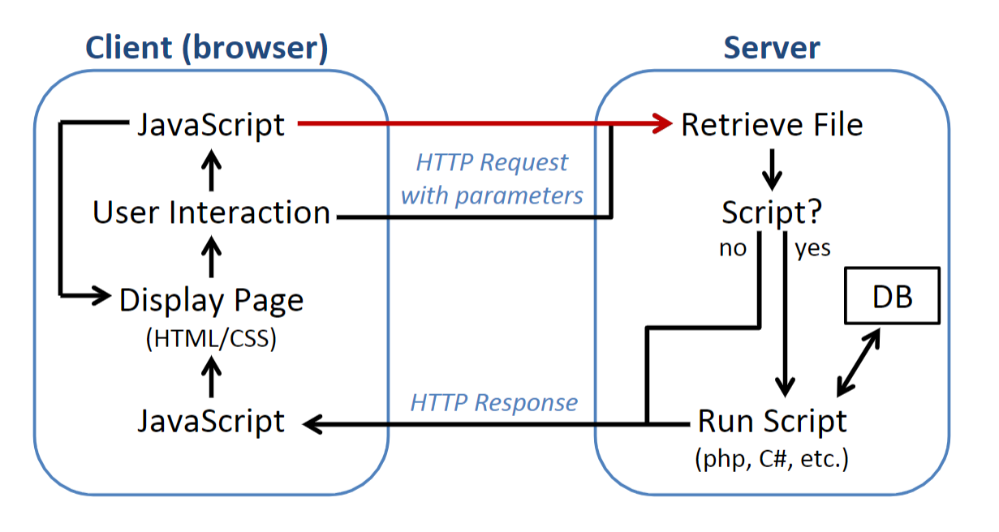

An overview of the web
# HTTP Client-Server Model

## The Client
- A 'client' is nothing more than a piece of software. i.e. some people refer to their browsers as a 'web client'
- Today, browsers use the HTTP (or HTTPs) protocol to communicate without outside resources
- This communication is done through REQUESTS to server using a URL (uniform resource locator)
- Request ex: GET img/image.jpg

## The Server
- The server is also a piece of software!
- Server addresses and port numbers tell the machine what software to execute
- After requests are processed an HTTP response is bundled
- Today, responses are commonly packaged as HTML, JSON, or XML

- Semester 2 dealt with the left side of the diagram, this semester we'll be dealing with the right!
- Notice that JS is being executed both by the client and server responses
#  Tooling
Whats driving the client-server relationship today?
## AJAX

- A lot of the web today is built on asynchronous java-script and XML (AJAX)
- Done through async HTTP requests to servers without reloading entire web pages
- Async interaction with a server provides dynamic content updates without UI disruption. Many languages now use an async-await model 
- Example: Loading menu bars in MyCanvas. How does that work? AJAX! 
- Keep in mind that the async concept is not exclusive to AJAX! But it is the most popular tooling used for the web

## REST
- Stands for Representational State Transfer
- Used to standardize data exchange
- Any API that is 'RESTful' provides standardized interfaces to web servers to manipulate resources using HTTP Methods
- Methods include GET, POST, PUT, DELETE
- RESTful APIs will work with any software making HTTP requests, not just browsers!

## PHP
- PHP is a scripting language commonly used as a server-side scripting language
- PHP acts as the intermediate between a client and server, facilitating dynamic web generation 

# The Life Cycle Of A Request

## Request Initiation

- When a user interats with a web application, such as submitting a form, the 'client' sends and HTTP request to the server
### The HTTP Request Header

- Request Method: Specifies the type of HTTP method used in the request, such as GET, POST, PUT, DELETE, etc. For example, in a form submission, the method might be POST.

 - Request URI (Uniform Resource Identifier): Represents the specific resource (e.g., web page, image, file) the client wants to access on the server.

- User-Agent: Identifies the client software (e.g., web browser) making the request. It helps servers understand how to format the response based on the client's capabilities.

- Host: Specifies the hostname of the web server to which the client is sending the request.

- Accept: Indicates the types of content (e.g., HTML, JSON, XML) the client can handle as a response.

## Web Server Processing

- Server will forward a request to the appropriate server-side application
- When receiving PHP, the server will recognize the .php extension and give the request to the PHP interpreter

## Executing PHP 

- A PHP interpreter will process a script and perform its tasks
- Common tasks include accessing DBs, files and external APIs

## Web Server Response

 - PHP is often just outputting "strings" to return to the client
- These strings generate dynamic content client side when processed as HTML, CSS, or JS
- It is up to the client to interpret the strings to generate the content! AJAX!
### HTTP Response Headers

- Status Code: Indicates the result of the request. Common status codes are 200 (OK), 404 (Not Found), 500 (Internal Server Error), etc.

- Content-Type: Specifies the type of content being sent in the response, like text/html for HTML content or application/json for JSON data.

- Content-Length: Indicates the size of the response content in bytes.

Set-Cookie: Used to set cookies on the client's side for managing sessions or user-specific data.

